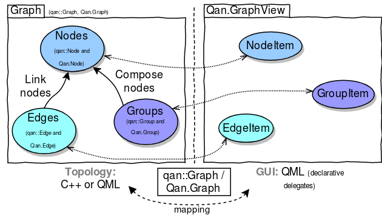
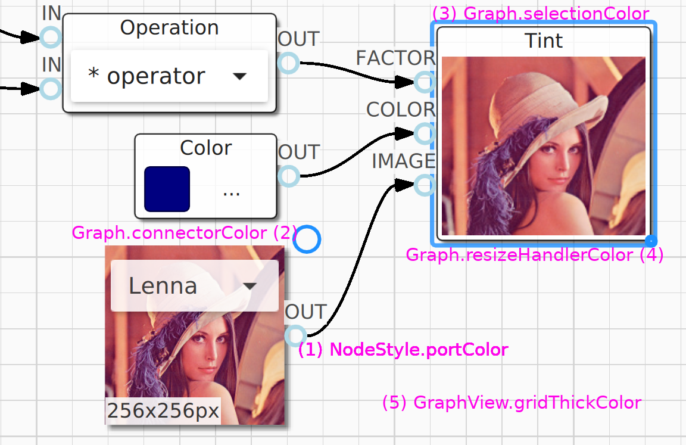
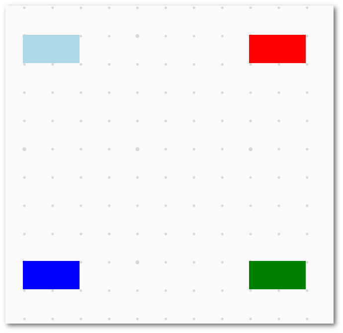
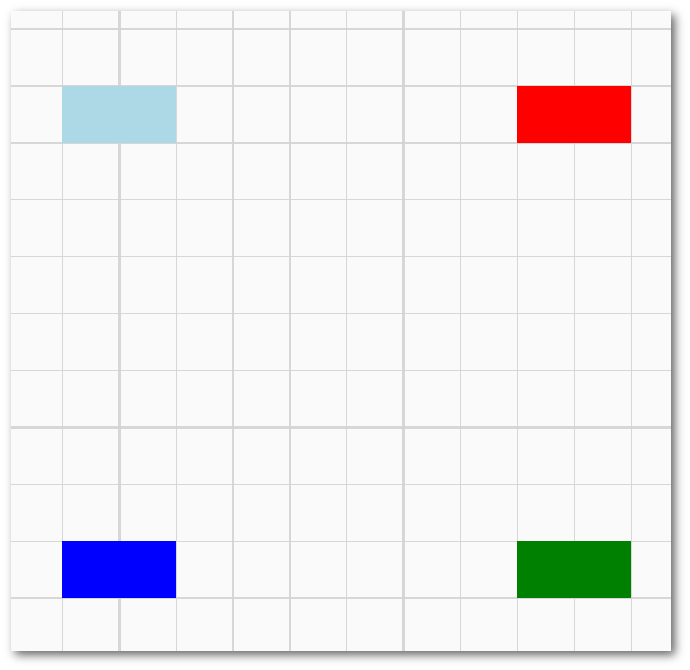

Graph Topology and Visualization
============================

Data Model
------------------




QuickQanava data model enforce a clear separation between description of topology and it's visual representation:

- Topology is defined from C++ or QML (with imperative Js) using the `qan::Graph` interface. 
- Topology primitives returned by `createX()` or `insertX()` have a visual counterpart available trough their `getItem()` method or `item` property.

To keep data-model simple and efficient, topology is defined in a imperative way in C++ code or in a QML `Component.onCompleted()` handler. Visual representation of graph topology is then managed from a view, usually in pure QML with `Qan.GraphView` component. The unique proxy for editing topology is `qan::Graph` class and it's QML interface `Qan.Graph`.

Graph topology is internally modeled using [adjacency lists](https://en.wikipedia.org/wiki/Adjacency_list), these lists are exposed to QML and C++ with Qt abstract item models: a change in topology trigger a signal or a virtual method call in behavior observers. For example, any view connected to a node `outNodes` model is automatically updated when a directed edge is inserted from that node to another one.

QuickQanava Initialization 
------------------

QuickQanava should be initialized in your c++ main function:

``` cpp hl_lines="9"
#include <QuickQanava>

int main(int argc, char *argv[])
{
    QGuiApplication app(argc, argv);
    QQuickStyle::setStyle("Material");
    QQmlApplicationEngine engine;
	// Or in a custom QQuickView constructor:
    QuickQanava::initialize();
	engine.load( ... );
    return app.exec();
}
```

Then, in QML import QuickQanava:
``` cpp
import QuickQanava 2.0 as Qan
import "qrc:/QuickQanava" as Qan
```

And create a `Qan.Graph` component to build a simple directed graph:
``` cpp
Qan.Graph {
    id: graph
    anchors.fill: parent
    Component.onCompleted: {
        var n1 = graph.insertNode()
        n1.label = "Hello World"
    }
}
```

Graph View
------------------

A `Qan.Graph` or `#!js qan::Graph` is actually a graphic item, but it is mainly used to define graph topology and should be embedded in a "graph view", following a (loose) MVC pattern to enable complete user interaction with the graph. A graph is binded to a view trough the `Qan.GraphView.graph` property:

``` cpp hl_lines="5"
Qan.GraphView {
  id: graphView
  anchors.fill: parent
  navigable   : true
  graph: Qan.Graph {
      id: topology
    } // Qan.Graph: topology
} // Qan.GraphView
```

Binding a `Qan.Graph` component to `graph` property of a `Qan.GraphView` item allow navigation using mouse panning and zooming, navigation could be disabled by setting the `QanGraph.navigable` property to false (it default to true).

There is more options for customizing how the view is rendered:



- `#!js Qan.Graph.connectorColor`: Visual edge creation tool 'handler' color (default to dodgerblue).
- `#!js Qan.Graph.selectionColor`: Selection rect color (available for nodes and groups).
- `#!js Qan.GraphView.resizeHandlerColor`: Bottom right corner resize handler color.
- `#!js Qan.GraphView.resizeHandlerOpacity`, `#!js resizeHandlerRadius`, `#!js resizeHandlerWidth` and `#!js resizeHandlerSize`: More options for bottom right corner resize handler configuration.
- `#!js Qan.GraphView.gridThickColor`: Grid major thick color (works for both point and line grids).

For a more detailed description, see [Material Styling](styles.md#material)


Grid
------------------

Grid could be configured with `Qan.GraphView.grid` property, either a point or line grid could be used (`Qan.PointGrid` and `Qan.LineGrid` components), default grid is drawn with orthogonal lines.

``` cpp hl_lines="5"
import QuickQanava          2.0 as Qan
import "qrc:/QuickQanava"   as Qan

Qan.GraphView {
  id: graphView
  anchors.fill: parent
  graph: Qan.Graph {
      gridThickColor: "lightgrey"
      grid: Qan.LineGrid{ 
        gridScale: 50
        gridMajor: 5
      }
      // or 
      //grid: Qan.PointGrid{
      //}
    } // Qan.Graph: topology
} // Qan.GraphView
```

Grid appearance is configurable using the following abstract interface working for both points and lines grids:

- `gridScale`: Interval in points between lines or points.
- `gridMajor`: Number of thicks between major points or lines (for example for lines, setting `gridMajor` to 5.0 means that a major strong line will be drawn every 5 grid tiles).
- `gridWidth`: size in points, either grid points or line width.
- `thickColor`: Color for points or lines.

| Qan.PointGrid                                       |Qan.LineGrid                                       |
| ---                                                 | :---:                                             | 
|   |  | 

!!! warning "As of 20180602, grid support is still under development, see issues [33](https://github.com/cneben/QuickQanava/issues/33) and [25](https://github.com/cneben/QuickQanava/issues/25). Snap to grid is also unsupported, contributions are welcome !"

